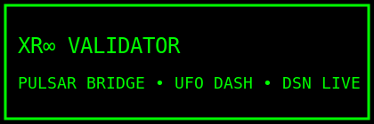

# 👽 XR∞ — Costellazione orbitale decentralizzata



Sistema scientifico, mitico e industriale per osservazione pulsar, monitoraggio token, e rituali decentralizzati.

## 🚀 Installazione

```bash
git clone <repo>
cd xr∞_anello
bash xr∞_genesis.sh
```

## 🌐 Dashboard

- Pulsar Dashboard: [http://localhost:5000](http://localhost:5000)
- Monitor : [Birdeye](https://birdeye.so/token/0xfc90516a1f736FaC557e09D8853dB80dA192c296?chain=polygon)

## 🛸 Moduli

- eco_log.py • pulsar_dashboard_web.py • badge • manifesto • pages

Ogni modulo è una stella. Ogni fork è una nuova orbita.
